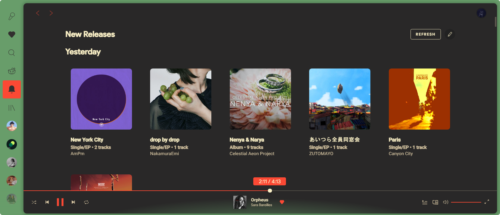

# Dribbblish

### Base

### White

### Dark

### Nord-Light

### Nord-Dark

### Beach-Sunset

### Purple

### Samourai

### Gruvbox


##  Features
### Resizable sidebar

 

### Customizable sidebar
Rearrange icons positions, stick icons to header or hide unnecessary to save space.
Turn on "Sidebar config" mode in Profile menu and hover on icon to show control buttons.
After you finish customizing, turn off Config mode in Profile menu to save.

 

### Playlist Folder image
Right click at folder and choose images for your playlist folder. Every image formats supported by Chrome can be used, but do keep image size small and in compressed format.

 

### Left/Right expanded cover
In profile menu, toggle option "Right expanded cover" to change expaned current track cover image to left or right side, whereever you prefer.

## Auto-install
Make sure you are using spicetify >= v2.5.0 and Spotify >= v1.1.56.
### Windows
```powershell
Invoke-WebRequest -UseBasicParsing "https://raw.githubusercontent.com/morpheusthewhite/spicetify-themes/master/Dribbblish/install.ps1" | Invoke-Expression
```

## Manual Install
Run these commands:

### Linux and MacOS:
In **Bash**:
```bash
cd "$(dirname "$(spicetify -c)")/Themes/Dribbblish"
mkdir -p ../../Extensions
cp dribbblish.js ../../Extensions/.
spicetify config extensions dribbblish.js
spicetify config current_theme Dribbblish color_scheme base
spicetify config inject_css 1 replace_colors 1 overwrite_assets 1
spicetify apply
```

### Windows
In **Powershell**:
```powershell
cd "$(spicetify -c | Split-Path)\Themes\Dribbblish"
Copy-Item dribbblish.js ..\..\Extensions
spicetify config extensions dribbblish.js
spicetify config current_theme Dribbblish color_scheme base
spicetify config inject_css 1 replace_colors 1 overwrite_assets 1
spicetify apply
```

From Spotify > v1.1.62, in sidebar, they use an adaptive render mechanic to actively show and hide items on scroll. It helps reducing number of items to render, hence there is significant performance boost if you have a large playlists collection. But the drawbacks is that item height is hard-coded, it messes up user interaction when we explicity change, in CSS, playlist item height bigger than original value. So you need to add these 2 lines in Patch section in config file:
```ini
[Patch]
xpui.js_find_8008 = ,(\w+=)32,
xpui.js_repl_8008 = ,${1}56,
```

## Change Color Schemes
There are 9 color schemes you can choose: `base`, `white`, `dark`, `dracula`, `nord-dark`, `nord-light`, `beach-sunset`, `samourai`, `purple`. Change scheme with commands:
```
spicetify config color_scheme <scheme name>
spicetify apply
```

## Auto-uninstall 
### Windows
```powershell
Invoke-WebRequest -UseBasicParsing "https://raw.githubusercontent.com/morpheusthewhite/spicetify-themes/v2/Dribbblish/uninstall.ps1" | Invoke-Expression
```

## Manual uninstall 
Remove the dribbblish script with the following commands 

```
spicetify config extensions dribbblish.js-
```
And remove Patch lines you added in config file earlier. Finally, run:
```
spicetify apply
```
