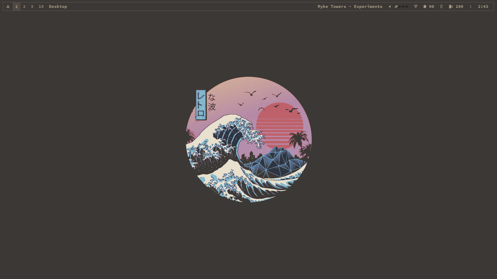

    <h1>.dotfiles</h1>
    
There's no place like <b><code>~</code></b> !

    

    
      
    

### Table of Contents

-   [Screenshots](#screenshots)
-   [Introduction](#introduction)

### Screenshots
## Latest Screenshots

### Introduction

This repository contains my personal configuration files. The package lists can be found in `~/.pkglist/`. To install all
official packages, use `pacman -S - < all_packages` and to install all
aur packages use `yay -S --needed - < aur_packages` (must have yay installed).
