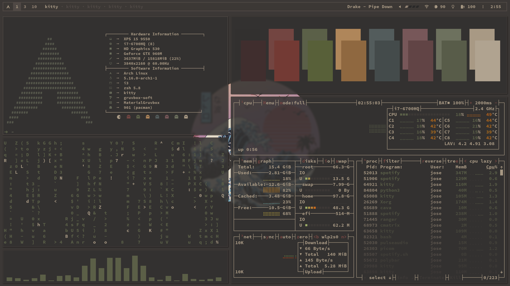

<div align="center">
    <h1>.dotfiles</h1>
    <p>There's no place like <b><code>~</code></b> !</p>
    <p>
    
    <br><br>
    </p>
</div>

### Table of Contents

-   [Screenshots](#screenshots)
-   [Introduction](#introduction)
-   [Setup Repository](#setup-repository)

### Screenshots
## Latest Screenshots




### Introduction

To clone this repository and it's submodules use:
```bash
git clone --recurse-submodules https://github.com/jasolisdev/.dotfiles.git
```

This repository contains my personal configuration files (also known as
_dotfiles_). The package lists can be found in `~/.pkglist/`. To install all
official packages, use `cat .pkglist/pacman | pacman -S -` and to install all
aur packages use `cat .pkglist/aur | yay -S -`, for convenience `cat
.pkglist/aur-pacman | yay -S -` to install both official and aur packages (must
have yay installed).

In the following sections I'll explain how this dotfiles repository was set up,
how to use it and how to restore them, for example on a new device.

### Setup Repository

My method of setting up my .dotfiles repository is kept simple by keeping your home dir in
Git with a detached working directory. There are many methods out there for
managing dotfiles and a multitude of pre-made tools. So what makes my method
better than the rest? Well the answer is: it depends. The method I'm about to
describe is one that suits me personally because:

- It’s simple to implement, simple to understand and simple to use.
- No special tools required, other than Git itself. A tiny alias in your .profile takes care of all of it.
- No fiddling with symlinks and other nonsense.

**How does it work?**
It’s simple. We create what is called a “detached working tree“. In a normal git repository,
you’ve got your .git dir, which is basically your repository database. When you perform 
a checkout, the directory containing this .git dir is populated with files from the git 
database. This is problematic when you want to keep your home directory in Git, since 
many tools (including git itself) will scan upwards in the directory tree in order to find 
a .git dir. This creates crazy scenario’s such as Vim’s CtrlP plugin trying to scan your 
entire home directory for file completions. Not cool. A detached working tree means your 
.git dir lives somewhere else entirely. Only the actual checkout lives in your home dir. 
This means no more nasty .git directory.

An alias ‘dgit‘ is added to your .profile that wraps around the git command. 
It understands this detached working directory and lets you use git like you would 
normally. The dgit alias looks like this:

```bash
$ alias dgit='git --git-dir ~/.dotfiles/.git --work-tree=$HOME'
```

Simple enough, isn’t it? We simply tell git that our working tree doesn’t reside in the 
same directory as the .git dir (~/.dotfiles), but rather it’s our directory. We set the 
git-dir so git will always know where our actual git repository resides. Otherwise it 
would scan up from the curent directory your in and won’t find the .git dir, since that’s 
the whole point of this exercise.

**Setting it up**

Create a directory to hold your git database (the .git dir):
```bash
$ mkdir ~/.dotfiles/
$ cd ~/.dotfiles/
~/.dotfiles$ git init
```
Create a .gitignore file that will ignore everything. You can be more conservative here 
and only ignore things you don’t want in git. I like to pick and choose exactly which 
things I’ll add, so I ignore everything by default and then add it later.
```bash
~/.dotfiles$ echo "*" > .gitignore
~/.dotfiles$ git add -f .gitignore 
~/.dotfiles$ git commit -m "Git: Add gitignore"
```
Now we’ve got a repository set up for our files. It’s out of the way of our home directory, 
so the .git directory won’t cause any conflicts with other repositories in your home 
directory. Here comes the magic part that lets us use this repository to keep our home 
directory in. Add the dgit alias to your .bashrc or .profile, whichever you prefer:
```bash
~/.dotfiles$ echo "alias dgit='git --git-dir ~/.dotfiles/.git --work-tree=\$HOME'" >> ~/.zsh.d/alias.zsh
```
You’ll have to log out and in again, or just copy-paste the alias defnition in your 
current shell. We can now the repository out in our home directory with the dgit command:
```bash
~/.dotfiles$ cd ~
$ dgit reset --hard
HEAD is now at 642d86f gitignore
```
Now the repository is checked out in our home directory, and it’s ready to have stuff 
added to it. The dgit reset --hard command might seem spooky (and I do suggest you make 
a backup before running it), but since we’re ignoring everything, it’ll work just fine.

**Using it**

Everything we do now, we do with the dgit command instead of normal git. In case you 
forget to use dgit, it simply won’t work, so don’t worry about that.

A dgit status shows nothing, since we’ve gitignored everything:
```bash
$ dgit status
On branch master
nothing to commit, working directory clean
```
We add things by overriding the ignore with -f:
```bash
$ dgit add -f .profile 
$ dgit commit -m "Added .profile"
[master f437f9f] Added .profile
 1 file changed, 22 insertions(+)
 create mode 100644 .profile
```
We can push our configuration files to a remote repository:
```bash
$ dgit remote add origin git@github.com:jasolisdev/.dotfiles.git
$ dgit push origin master
 * [new branch]      master -> master
```
And easily deploy them to a new machine:
```bash
$ ssh someothermachine
$ git clone git@github.com:jasolisdev/.dotfiles.git ./.dotfiles
$ alias dgit='git --git-dir ~/.dotfiles/.git --work-tree=$HOME'
$ dgit reset --hard
HEAD is now at f437f9f Added .profile
```
Please note that any files that exist in your home directory ***will be overwritten*** by the files 
from your repository if they’re present.

**Track Files**

Use the default git subcommands to track, update and remove files. You can
obviously also use branches and all other features of git.
```bash
dgit status
dgit add .zshrc
dgit commit -m 'Zsh: Add zshrc'
dgit add .vimrc
dgit commit -m 'Vim: Add vimrc'
dgit push origin master
```
To remove a file from the repository while keeping it locally you can use:
```bash
dgit rm --cached ~/.some_file
```
